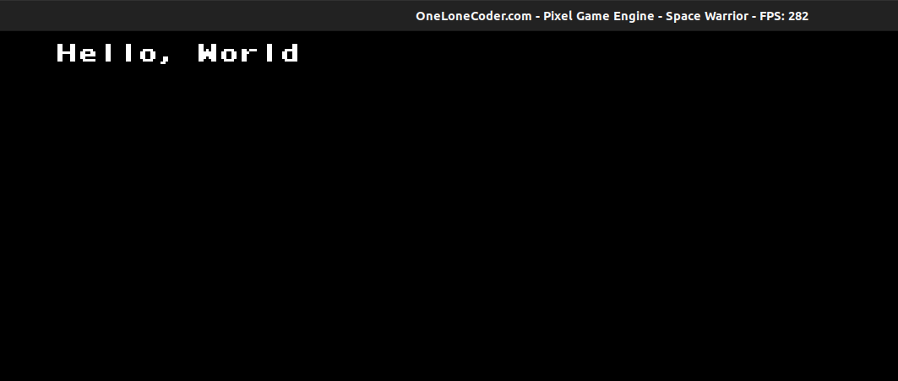

# Hello, OLC!

It's time to write your first program using [olc::PixelGameEngine](https://github.com/OneLoneCoder/olcPixelGameEngine). how can we break the tradition, we will start by writing a simple *Hello, World* program.
## Setting up the Project

* Begin by making a directory to store your Code. I'll name it *Space Warrior* that will be the name of the game we are going to create
* Add Header file `olcPixelGameEngine.h` to our current directory which you can download [here](https://github.com/OneLoneCoder/olcPixelGameEngine).
* Create a new `.cpp` file, name it `main.cpp` in the current direcotry.

## Hello, World!
Add following contents to the `main.cpp` file.
We begin by including the header `olcPixelGameEngine`
```cpp
#define OLC_PGE_APPLICATION
#include "olcPixelGameEngine.h"
```

Now let us create a new class for our Game, `Game` it will inherit `olc::PixelGameEngine`

```cpp
  class Game : public olc::PixelGameEngine
  {
    public:
	Game()
	{
		sAppName = "Space Warrior";
	}

	bool OnUserCreate() override
	{
		// Called once at the start, so create things here
		return true;
	}

	bool OnUserUpdate(float fElapsedTime) override
	{
	  Clear(olc::BLACK);
	  DrawString(5,5, "Hello, World");	
	  return true;
	}
};
``` 

Any class that inherits from `olc::PixeGameEngine` should override two functions, `OnUserCreate` and `OnUserUpdate`. Don't worry we will
get into details later.

Now lets write our main function, main function would be very neat

```cpp
int main()
{
	Game game;
	if (game.Construct(256, 240, 4, 4))
		game.Start();

	return 0;
}
```

## Compilation and Running the Program
If you have everything setup as mentioned in the chapter *Write your First Game in C++*, you should be
able to issue following commands in the *terminal/command prompt*.

### For Linux
You should move on to the current directory first.
#### Compiling
```shell
$ g++ -o main main.cpp -lX11 -lGL -lpthread -lpng -lstdc++fs -std=c++17
```

#### Running
```shell
$ ./main
```

### For Windows
You should move on to the current working directory first.
#### Compiling
```shell
$ g++ -o main.exe main.cpp -luser32 -lgdi32 -lopengl32 -lgdiplus -lShlwapi -ldwmapi -lstdc++fs -static -std=c++17
```
#### Running
```shell
$ main.exe
```


That's it now if you run this program, you should see a window with string "Hello, World" being displayed like this:




## Getting into Details
 As mentioned earlier we inherited our class from `olc::PixelGameEngine` and then we override two functions,

 ### OnUserCreate()
   The function `OnUserCreate` is called only once by the engine at the start.
   Let us look at the definition again,
   ```cpp
   bool OnUserCreate() override
    {
        // Called once at the start, so create things here
        return true;
    }
   ```
   This function returns a `bool` value, since the function is called only once, we can use this
   for the initialization stuff. However at the moment we have nothing to initialize, so we will
   just return `true` from the method.

 ### OnUserUpdate()
   This function is called repeatedly by the engine per frame. For smooth transition of the game, we need to keep updating the frame and whenever the frame is updated this function is called.
   Let us check out the code of `OnUserUpdate` method again,
   ```cpp
   bool OnUserUpdate(float fElapsedTime) override
    {
      Clear(olc::BLACK);
      DrawString(5,5, "Hello, World");	
      return true;
    }
   ```

   Let us look at the function signature first, it returns a `bool` value, recieves a `float` as a
   parameter. We call the `Clear` function inside the function, `Clear` function clears contents of the
   previous frame We then called `DrawString` function and passed in the `x`, `y` coordinates where the   string would be displayed, and then the third parameter, `Hello, World` is the string to be displayed   in the screen. We exit the function by returning `true`.
### The main function
```cpp
int main()
{
    Game game;
    if (game.Construct(256, 240, 4, 4))
        game.Start();

    return 0;
}
```
In the main Function, we first created an object game, of type Game. We then need to tell the engine about the size of window we want to create we do so by using the`Construct` method. The `Construct` method returns `true` if the construction was successfull and then we call the `start` method which starts our game engine.

Next up we will look at some useful functions to draw basic shapes using the game engine.
