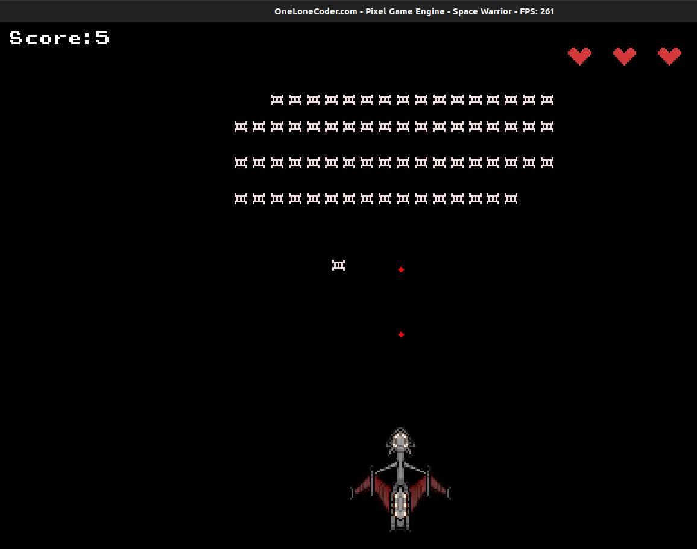

# Scoreboard and the Concept of Life
We are nearly at the end of the book now, we can move the player, shoot the threatful enemies, Let us now work out
for the Scoreboard and implement the concept of life.

The Rule of the game is simple, you kill a enemy you get 5 points, you collide with the enemy your life reduces by 1,
since collision kills the enemy, you will also gain those points.

To store the score and life count, add two new variables to the private member field of the class,
```cpp
private:
  int score = 0;
  int life_count = 3;
```

## Displaying the Score:
We will use the `DrawString` function to display the score, Update `OnUserUpdate` function to,

```cpp
DrawString(0, 5, "SCORE:" + std::to_string(score));
```
We also need to update the score, when the enemy is killed,
A enemy is killed when
* The bullet strikes the enemy
* The enemy collides with the player.

We now just need to add the following line where the above conditions are satisfied.
```cpp
score = score + 5;
```
We also need to reduce the `life_count` by 1 when
* The enemy collides with the player

So just add the following line where the above condition matches in the `OnUserUpdate` function.
```cpp
life_count = life_count - 1;
```
## Drawing the Life Sprite
We will use a the following sprite to represent the life count of a player


First we need to create a private member variable, sprLife to store a pointer to object
of type `olc::Sprite`

```cpp
std::unique_ptr<olc::Sprite> sprLife;
```
and then on `OnUserUpdate` method we assign `sprLife` as:
```cpp
bool OnUserCreate() override
{
  produceEnemy();
  sprPlayer = std::make_unique<olc::Sprite>("/home/abhilekh/Downloads/player.png");
  sprEnemy = std::make_unique<olc::Sprite>("/home/abhilekh/Downloads/enemy.png");
  sprLife  = std::make_unique<olc::Sprite>("/home/abhilekh/Downloads/life.png");
  
  return true;
}
```

To draw this sprite, we will use `DrawSprite` method, but the number of sprites to be displayed
depends on the `life_count`, so will use a `for` loop here,

```cpp
// load life sprite..
for (int i = 0; i < life_count; ++i) {
  DrawSprite(270 + sprLife->width + 25 * i, 5, sprLife.get());
}
```
We just passed in the `x`, `y` coordinate where the sprite is to be drawn and the
pointer to the object of type `olc::Sprite`.

Now if you compile and run the program, you should see something like this


All the codes till now, can be found [here](https://gist.github.com/Abhilekhgautam/889718740c2628d4e571fd0edf6e2799)

Next up we will work on polishing the game.
