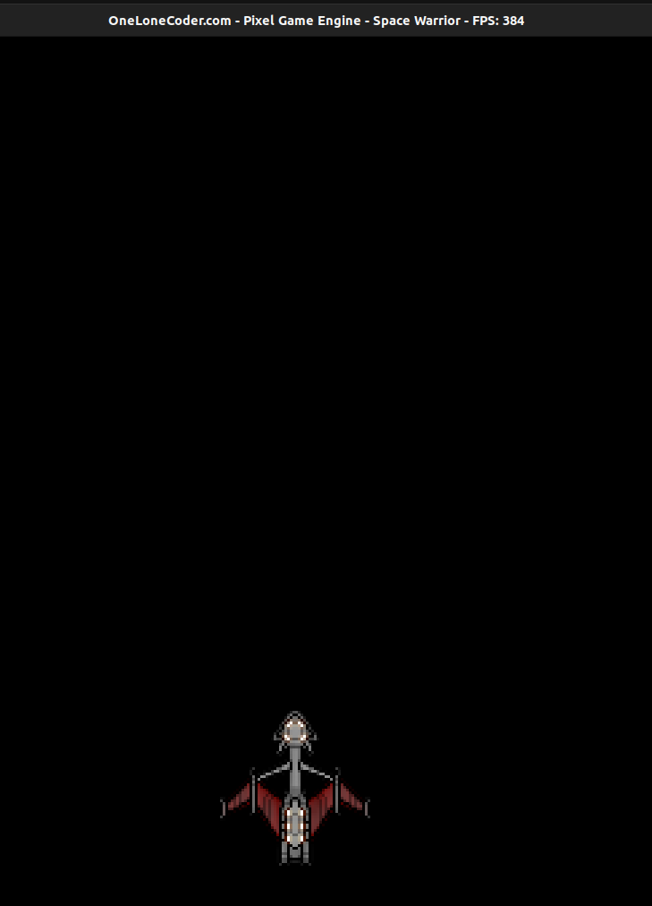

# Adding Our Player

Now on, we will start working on our game, let us start by adding our main player.

We will use `olc::sprite` to add our player, just think `sprite` as an `image`but before this let us initialize some member variables for our class.

```cpp
class Game : public olc::PixelGameEngine
{
public:
    Game()
    {
        sAppName = "Space Warrior";
    }

    bool OnUserCreate() override
    {
        
        return true;
    }

    bool OnUserUpdate(float fElapsedTime) override
    {
        return true;
    }
private:
    float fPlayerPositionX = 185.0f;
    float fPlayerPositionY = 250.0f;
};

```

Nothing new, just added two variables to denote the player's X and Y coordinates in the screen.

Now download the image provided below (hover and right click), for our player. You can use any image you want


## Loading Sprites
```cpp
class Game : public olc::PixelGameEngine
{
public:
   bool OnUserCreate() override 
    {
        sprPlayer = std::make_unique<olc::Sprite>("../sprites/player.png");
        return true;
    }

   bool OnUserUpdate(float fElapsedTime) override
    {
        Clear(olc::BLACK);
        DrawSprite(fPlayerPositionX, fPlayerPositionY, sprPlayer.get());
        return true;
    }
private:
    float fPlayerPositionX = 185.0f;
    float fPlayerPositionY = 250.0f;

    std::unique_ptr<olc::Sprite> sprPlayer;
};
```
Don't get scared, sprPlayer is just a pointer, that is very safe to work with.
sprPlayer holds a pointer to object of type `olc::Sprite`.

We have quite a few changes here,
We added,
```cpp
bool OnUserCreate() override
   {
        // sprites...
        sprPlayer = std::make_unique<olc::Sprite>("../sprites/player.png");
        return true;
    }

```
We simply initialized `sprEnemy` by passing filepath to
```cpp
std::make_unique<olc::Sprite>(file_path);
```

Similarly, In the `OnUserUpdate` method, we added
```cpp
bool OnUserUpdate() override
{
  DrawSprite(fPlayerPositionX, fPlayerPositionY, sprPlayer.get());
  return true;
}
```

We used `DrawSprite` method to draw the sprite on the screen, we passed in the position of
the player and a pointer contained by sprPlayer, remember I said earlier sprPlayer holds a
pointer to object of type `olc::sprite`, the `get` method just return that pointer.

To be on the same page, our `main` function should look like this
```cpp
int main()
{
    Game game;
    if (game.Construct(450, 340, 4, 4))
        game.Start();

    return 0;
}
```

Now if you run this program you should see something like this:


Don't worry if you see some compiler warnings, we will deal with them later.

Next we will add some life to our player, i.e. we will add some movement to the
player.

