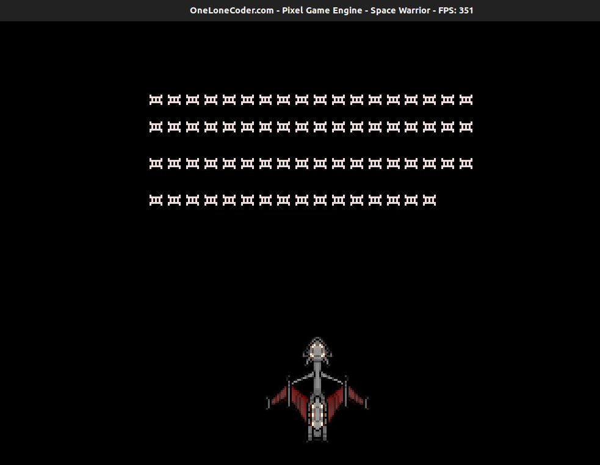

# Adding Enemies to Game

Let us now add enemies to our Game. I will use the image below for the enemy, you can download it by right clicking on it, or can choose any other image


But before we draw the sprite, let us create a `struct` that represents Enemy of our game

```cpp
struct Enemy{
 float x;
 float y;
 bool  alive;
}
```

Here x and y represent the x and y coordinate of the enemy and alive represents whether the enemy is alive or not.

You can add this Definition right before the class Definition.

We will have many enemies, so we will represent the collection of enemy using a vector.
Then let us add a vector to the private field of class, I will name it vEnemy.

```cpp
std::vector<Enemy> vEnemy;
```
Here, `vEnemy` is a vector(collection) of Enemy.

Adding enemy is similar to that of player, we will again use `olc::sprite`.

Add `sprEnemy` to the private variable field too,
```cpp
std::unique_ptr<olc::Sprite> sprEnemy;
```

Similarly, update the `OnUserCreate` method to
```cpp
bool OnUserCreate() override
{
  sprPlayer = std::make_unique<olc::Sprite>("/home/abhilekh/Downloads/player.png");
  sprEnemy = std::make_unique<olc::Sprite>("/home/abhilekh/Downloads/enemy.png");
  return true;
}
```

## Positioning the Enemies

The `enemy` struct has two fields to represent its coordinate axis, we will simply need to assign them with some values, and draw sprites in those positions.

Let us add a new method to our class, I will name it `produceEnemy`,
```cpp
void produceEnemy() {
  for (int i = 0; i < 70; ++i) {
    if (i < 18)
       vEnemy.emplace_back(Enemy{float(ScreenWidth()) / 2 + (float) i * 10 - 100, 40.0f, true});
    else if (i < 36)
       vEnemy.emplace_back(Enemy{float(ScreenWidth()) / 2 + 10.0f * (float) i - 280, 55.0f, true});
    else if (i < 54)
       vEnemy.emplace_back(Enemy{float(ScreenWidth()) / 2 + 10.0f * (float) i - 460, 75.0f, true});
    else
       vEnemy.emplace_back(Enemy{float(ScreenWidth()) / 2 + 10.0f * (float) i - 640, 95.0f, true});
   }
}

```

Nothing new here, we run the loop for 70 times, meaning we will have total of 70 enemies,
then we use `emplace_back` to add enemy to the vector.

Let me workout this for you when `i = 0`,
`i < 0` so the first condition will be satisfied and the following value will be added to the vector

```cpp
Enemy{ScreenWidth() / 2 + 0 - 100, 40.0f, true}
```
This means when `i = 0` a new Enemy object with,
```
x = ScreenWidth() / 2 + 0 - 100
y = 40
alive = true
```
will be added to the vector. In the similar way 70 different `Enemy` object with different x and y coordinates will be added to the vector.

We will need to create the enemy only once throughout the game so let us call the `produceEnemy` from the `OnUserCreate` method as:
```cpp
bool OnUserCreate() override
{
 produceEnemy();
 sprPlayer = std::make_unique<olc::Sprite>("/home/abhilekh/Downloads/player.png");
 sprEnemy = std::make_unique<olc::Sprite>("/home/abhilekh/Downloads/enemy.png");
 return true;
}
```
## Displaying the Sprite

Displaying the Enemy is similar to displaying the player, the only difference is we have to use a loop to draw enemy because
we have 70 enemies in total

```cpp
for (auto elm: vEnemy) {
  if (elm.alive)
    DrawSprite(elm.x, elm.y, sprEnemy.get());
}
```
We used a `range based for loop` and called the `DrawSprite` function with the enemies position and
a pointer to `olc::sprite` object.

So our `OnUserUpdate` method should look like this,
```cpp
bool OnUserUpdate(float fElapsedTime) override
{
  DrawSprite(fPlayerPositionX, fPlayerPositionY, sprPlayer.get());
  if (GetKey(olc::Key::LEFT).bHeld)
  {
    fPlayerPositionX = fPlayerPositionX - fPlayerVel * fElapsedTime;
  }
  if (GetKey(olc::Key::RIGHT).bHeld)
  {
    fPlayerPositionX = fPlayerPositionX + fPlayerVel * fElapsedTime;
  }
  if (GetKey(olc::Key::UP).bHeld) {
    fPlayerPositionY = fPlayerPositionY - fPlayerVel * fElapsedTime;
   }
  if (GetKey(olc::Key::DOWN).bHeld)
  {
    fPlayerPositionY = fPlayerPositionY + fPlayerVel * fElapsedTime;
  }

  for (auto elm: vEnemy)
  {
     if (elm.alive)
       DrawSprite(elm.x, elm.y, sprEnemy.get());
  }
 return true;
}
```

And now if you compile and run the program you should see something like this,


Next up we will implementing bullet shooting for our player.
