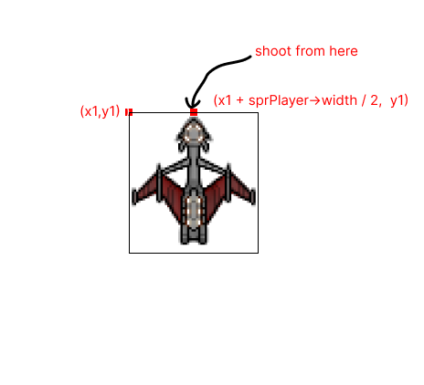

# Shooting the Bullets
We have a player and enemies, whats next? Lets shoot them.

We will need multiple bullets which we will store as a vector,
and we will also create a struct `Bullet` to represent a bullet
in our game.

```cpp
struct Bullet{
  float x;
  float y;
  bool dead;
};

```
Here `x` and `y` represents the position of the bullet and `dead` represents the 
current status of the bullet.

Let us then create another variable in our private field to represent the 
collection of Bullet. I'll name it `vBullet`, you can name it anything
you want.

```cpp
private:
  //Same as before
  std::vector<Bullet> vBullet;
  // Same as before
```

We should first decide the key that should be pressed so the player 
will shoot.

I choose the `space` key, you can choose any key of your choice.
Let us update the `OnUserUpdate` method so that it listens to the
pressing of the space key.

```cpp
if (GetKey(olc::Key::SPACE).bPressed)
{
  float ftempX = fPlayerPositionX;
  float ftempY = fPlayerPositionY;
  vBullet.emplace_back(Bullet{ftempX + sprPlayer->width / 2, ftempY, false});
}
```
The main concern for the `Bullet` is determining their position, where should we shoot
the bullets from? It depends on the player's current position, afterall
the player is shooting the bullets. If you look at our `sprPlayer` sprite, it would be better
if we could shoot from the center of the `sprite`.


Whenever `space` key is pressed we add a new Bullet to the vector with values set to
```
x = fPlayerPostionX + sprPlayer->width / 2
y = fPlayerPositionY
dead = false
```

here `fPlayerPositionX` is the top left corner of the player's sprite, to move to the
center of image we should add up half the width of the image to its top left position.

## Drawing the bullets

We will simply use a circle with the radius set to 1, as a bullet.
Similar to drawing enemies, we will use a loop here, as we have a collection
of bullets.

```cpp
for (auto &elm: vBullet)
{
  if (elm.y > -1 && !elm.dead) 
  {
    FillCircle(elm.x, elm.y, 1, olc::RED);
  }
}
```
We don't need to draw bullets that are gone away from the screen display area, so I used the if statement to ensure that.
## Moving the Bullets

We need to move the bullets with some speed, so let us declare yet another private member
variable that represents the bullet velocity, I will name it `fBulletVel`, and set it as 

```cpp
float fBulletVel = 180.0f;
```
Moving the bullet means translating its position, since bullets will be fired upward we will be 
subtracting the `y` coordinate of the bullet with its speed.

```cpp
for (auto &elm: vBullet)
{
  // only take care of bullets which are visible on the screen
   if (elm.y > -1 && !elm.dead) 
   {
     FillCircle(int(elm.x), int(elm.y), 1, olc::RED);
     elm.y = elm.y - fBulletVel * fElapsedTime;
   }
}
```
Remember that, we multiply `fBulletVel` with `fElapsedTime` as we discussed in [chapter 4](https://abhilekhgautam.github.io/Your-First-Game-in-CPP/book/chapter_4/index.html).

You can find all the codes [here](https://gist.github.com/Abhilekhgautam/c9d8b54d2d74c9aea583564ca28ae388).

If you have updated the code as I mentioned, you should now be able to shoot bullets. But the bullet doesn't
kill any enemy yet.

Next up we will implement collision detection for the Bullet and the enemy. Until then Have Fun!
