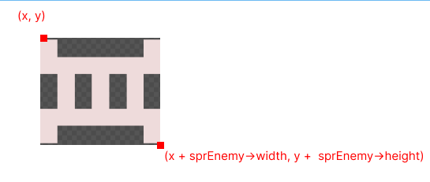
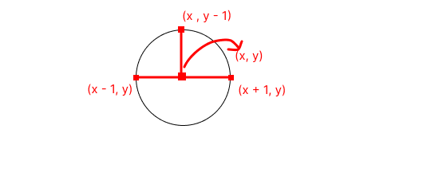
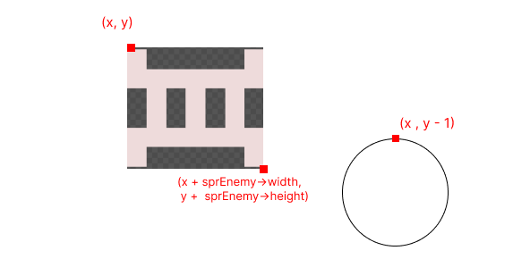
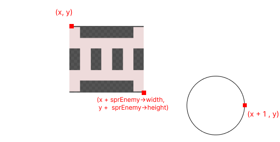
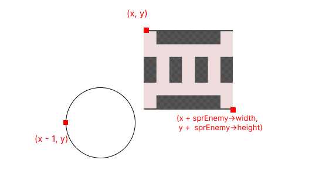

# Collision Detection - I
So far so good, we have a player that can move and shoot bullets. We also have enemy that pose threats to the player, the player needs to kill the enemy with the help of the bullets. So will be implementing this.

To kill the enemy we need to find out whether the bullet collided with the enemy or not.
This is gonna be one of the tricky part of the entire program, But no problem I will try to explain everything.

## Detecting the collision
It might sound simple but when the coordinate of both bullets and the enemy are same they will collide. That's right but not totally, this is because our enemy has width and touching any part of that enemy should be considered as a collision.

Let us first look at the image below:


Colliding with such enemy means, the x coordinate of the bullet can have the value in the range from, enemy's `x` to `x + sprEnemy->width`.

But the bullet can be thought of a circle bounded inside a rectangle, in such way our bullet will also have a width and height.



So For collision, 
*  `Bullet.y -  1 >= Enemy.y + sprEnemy->height`, this means that the top most point of our bullet is in the same level or above `y + sprEnemy->height`
But this is not the only case, as:



The above image matches the above condition, but this is not the condition for collision, we have to check for the `x` coordinate as well.

* `Bullet.x + 1 >= Enemy.x`, this means that the extreme right point of the bullet must be greater than Enemy's `x` coordinate.
But this is also not the only case, as:



For the collision to take place (in X), we have to bound the extreme points of the bullet within `Enemy.x` to `Enemy.x + sprEnemy->width`

 To do so, we should set the condition for left extreme point as well

* `Bullet.x - 1 <= Enemy.x + sprEnemy->width`. But this is not the only condtion.



If we combine all these three condition, we will be able to detect the collision.

Combining all these three conditions we get
* `Bullet.y - 1 >= Enemy.y + sprEnemy->height`
* `Bullet.x + 1 >= Enemy.x`
* `Bullet.x - 1 <= Enemy.x + sprEnemy->width`

## Implementing the Collision

Too much talk, now lets see some code in action, add the following line to the
`OnUserUpdate` method
```cpp
for (auto &elm: vBullet) {
  for (auto &enemy: vEnemy) {
     if (!elm.dead && enemy.alive && elm.y > enemy.y && elm.x + 1 >= enemy.x &&
         elm.x - 1 <= enemy.x + float(sprEnemy->width) &&
         elm.y - 1 <= enemy.y + float(sprEnemy->height)) {
            // kill both bullet and enemy.
            elm.dead = true;
            enemy.alive = false;
        }
     }
}
```
We used a nested loop because we have to check the collision for each element against each enemy.

Now you should see the player killing the enemy, but enemies are very weak for us now.

Next up we will give life to our enemy.
