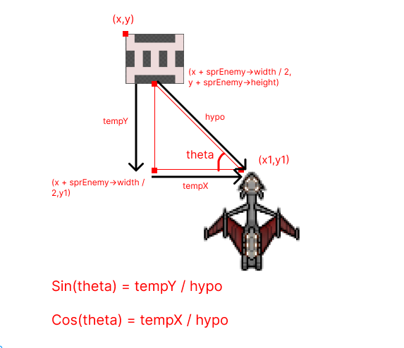
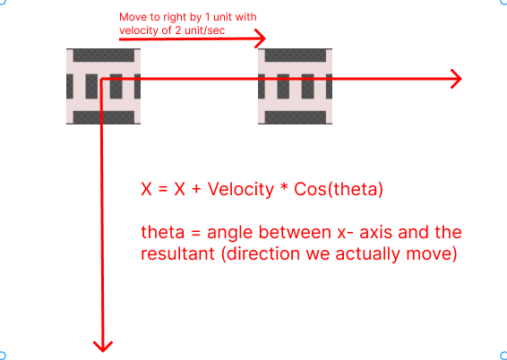
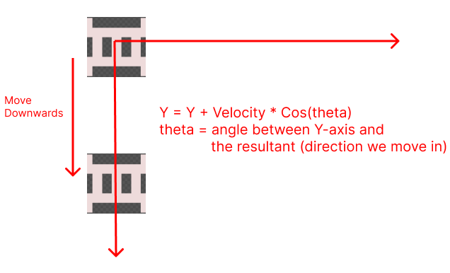
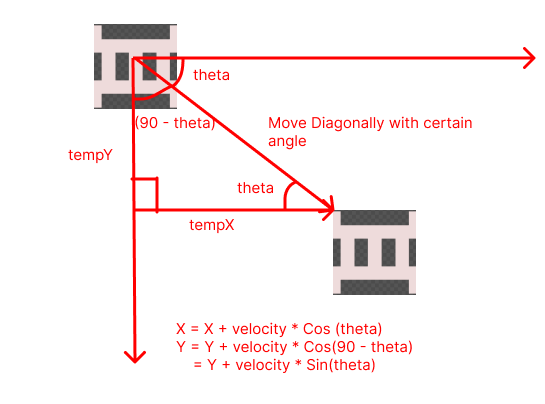
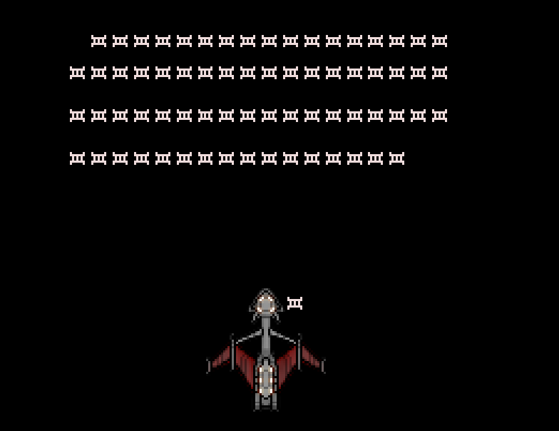

# Adding Life to the Enemy
Our enemy do nothing as we now, I want the enemies to move towards our player, and when it collides with our player, the life count of the player reduces.

## The Pythagoras Theorem
Since the enemy will be moving towards the player, we need to determine the path (or angle) at which enemy move. This is where the Pythagoras theorem comes in.



`tempY` is the vertical distance between the enemy and the player while `tempX` is the horizontal distance between the enemy and player.

To calculate the hypo (hypotenuse), we can use pythagoras theorem as,

\\(\ hypo = \sqrt{(tempY)^2 + (tempX)^2} \\)

`tempX` and `tempY` can be calculated as:
```cpp
tempX = x1 - (x + sprEnemey->width / 2);

tempY = y1 - (y + sprEnemy->height);
```
Note that the coordinates here are based on the above image.

So we can now calculate the value of `sin(theta)` and `cos(theta)`.
From basic mathematics we have,

```
sin(theta) = height_of_perpendicular / hypotenuse
```
which in our case turns out to be,
```
sin(theta) = tempY / hypo
```
Similarly,
```
cos(theta) = base / hypotenuse
```
which in our case turns out to be,
```
cos(theta) = tempX / hypotenuse
```
## What to do with the angles?
Remember that, when we moved to some X direction, we simply added the
speed to the `x` coordinate and when we moved to some Y direction, we
added the speed to the 'y' coordinate in case of the player.

But things slightly change here, since we are following the player, we have
to choose the shortest path. i.e. We won't only move in 
single direction(either X or either Y), we have to move diagonally
which means we have to travel some X and some Y distance at the same
time.
In fact we will travel with certain angle along the X and Y direction.
Let us look at things in some detail,


When we are moving horizontally, it looks like we are just adding the
x coordinate to the velocity, but in fact, what we really do is,

```
X = X + Velocity * cos(theta)
```
Where `theta` = angle between x-axis and the direction we move in, which is 0.

so, X turns out to be,
```
X = X + Velocity * cos(0)
  = X + Velocity
```

Similarly for the vertical movement,


When we are moving vertically downwards, X coordinate remains constant and
Y can be calculated as:
```
Y = Y + Velocity * Cos(theta)
```
where `theta` is the angle between Y-axis and the resultant.
So in this case,
```
Y = Y + Velocity * Cos(0)
  = Y + Velocity
```
Now let us focus on diagonal movements,


When we move diagonally, there is change in both X and Y coordinate,
to calculate them, we will simply use the concept we used earlier,

```
X = X + Velocity * Cos(theta)
Y = Y + Velocity * Cos(90 - theta)
  = Y + Velocity * Sin(theta)
```
Note that, When we move diagonally, the angle between Y-axis and the resultant
is `(90 - theta)`, and `Cos(90 - theta) = Sin(theta)`, so we multiply by `Sin(theta)` in case of Y.

## Implementation
Too much talk till now, let us write some code then,
Update the `OnUserUpdate` method to have following snippets:
```cpp
for(auto &elm : vEnemy){
  if(elm.alive)
  {
    float tempX = (fPlayerPositionX + sprPlayer->width / 2
        ) - elm.x + sprEnemy->height + sprEnemy->width / 2
                               );
    float tempY = (fPlayerPositionY - elm.y + sprEnemy->height);

    // simple pythagoras theorem
    float tempHypo = powf(tempX, 2) + powf(tempY, 2);
    float Hypo = sqrtf(tempHypo);

    float sinTheta = (tempY / Hypo);
    float cosTheta = (tempX / Hypo);

    elm.x = elm.x + fEnemyVel * cosTheta * fElapsedTime;
    elm.y = elm.y + fEnemyVel * sinTheta * fElapsedTime;
    break;
  }
}
```
We iterated through every enemy in the Enemy vector and then
we calculated the values of `tempX` and `tempY`using the techniques we discussed earlier,
and then calculated the `hypotenuse` and values of `sin(theta)` and cos(theta).

And then simply calculated the new coordinates.
```cpp
elm.x = elm.x + fEnemyVel * cosTheta * fElapsedTime;
elm.y = elm.y + fEnemyVel * sinTheta * fElapsedTime;
```
Note the inclusion of `fElapsedTime`, anything in a motion
should have its velocity multiplied by fElapsedTime.

There is a `break` statement at the end of the end block,
this is because we only want to move our enemy one at a time.

When you run this program, you should see one of the enemy following the player:


But we will need to kill the enemy when the collsion takes place, that is set for
the next chapter.
