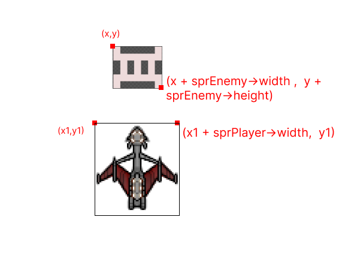

# Collision Detection - II
Earlier we talked about Collision Detection, where we detected the collsion 
between bullet and the enemy. This time we have to detect collision between
the enemy and player.

The concepts and techniques are similar as before,


I won't be explaining too much, If you are still confused head back to chapter-7, where I explained in detail about the collision detection.

## The conditions
* `x + sprEnemy->width >= x1`
* `x <= x1 + sprPlayer->width`
* `y + sprEnemy->height >= y1`

We check for the range of corners of the enemy, if they satisfy all of the above
condition, we can say that they have collided.

## Implementation
Update the `OnUserUpdate` method to contain following snippets,
```cpp
for(auto &elm : vEnemy){
  if(elm.alive)
  {
   // Same as before..
     if (elm.x + sprEnemy->width >= fPlayerPositionX &&
         elm.x <= fPlayerPositionX + sprPlayer->width &&
         elm.y + sprEnemy->height >= fPlayerPositionY)
        {
          elm.alive = false;
        }
      break;
  }
}
```
Above code justifies everything we talked earlier, nothing to explain here.
We set `elm.alive = false` to kill the enemy. So now you should see
enemies being killed on collision with the player.

All the updated code for `OnUserUpdate` method can be found [here](https://gist.github.com/Abhilekhgautam/bba81f6ed5294ad4038d6538fe94b9fc)

Next up we will add Scoreboard and implement the concept of life
for our Player.
